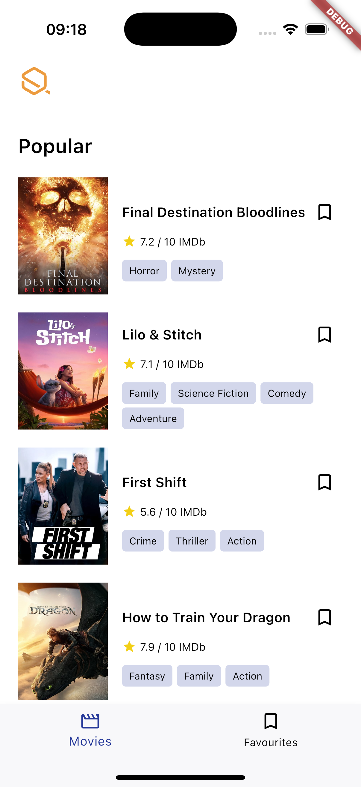
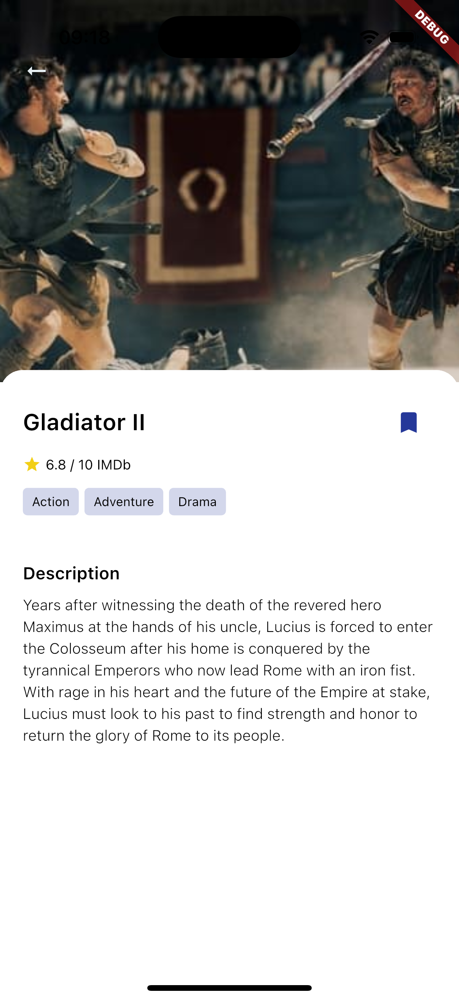
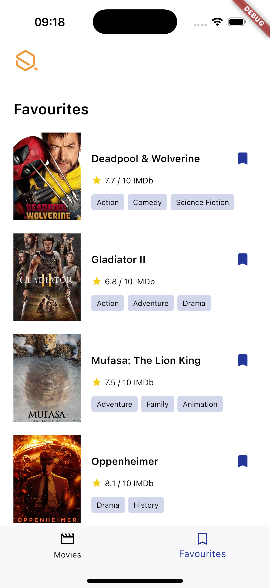
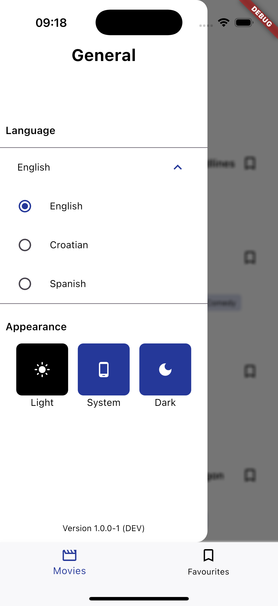
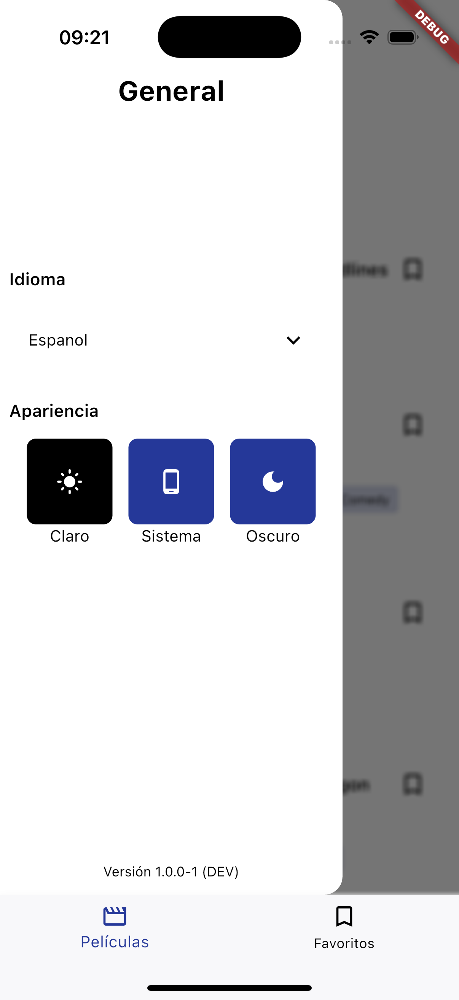
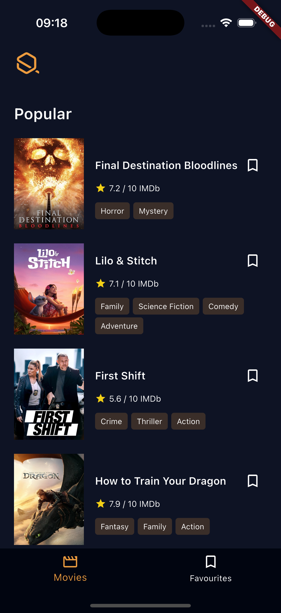
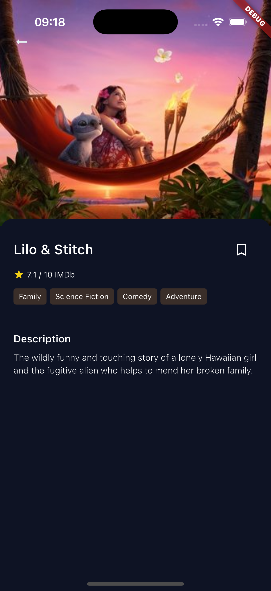
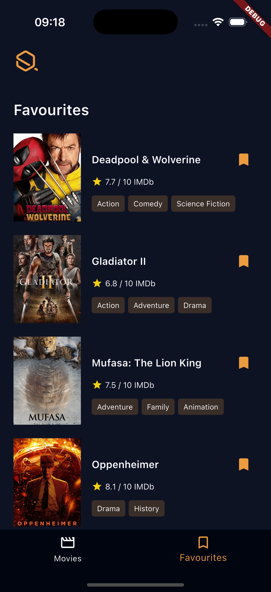
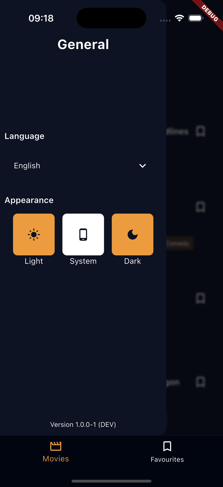
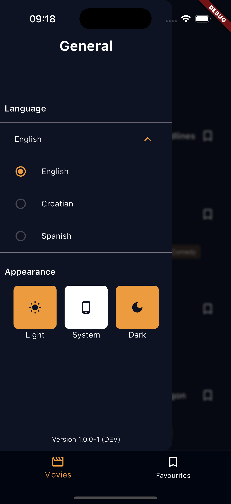

# Movie App 🎬

A modern Flutter mobile application that provides an immersive movie browsing experience using The Movie Database (TMDb) API. Discover popular movies, manage your favorites, and enjoy a seamless user experience with adaptive themes and localization support.

## Table of Contents
- [Features](#features-)
- [Screenshots](#screenshots-)
- [Architecture](#architecture-)
- [Getting Started](#getting-started-)
- [Testing](#testing-)
- [Features in Detail](#features-in-detail-)
- [API Integration](#api-integration-)
- [License](#license-)

## Features ✨

### Core Functionality
- **Popular Movies**: Browse trending and popular movies from TMDb
- **Movie Details**: View comprehensive information about each movie including synopsis, cast, ratings, and more
- **Favorites Management**: Add and remove movies from your personal favorites list
- **Offline Support**: Cached favorite movies data for offline access

### User Experience
- **Dual Theme Support**: Switch between light and dark modes
- **Localization**: Multi-language support with easy language switching
- **Pull-to-Refresh**: Refresh movie data with a simple pull gesture
- **Infinite Scroll**: Seamless pagination for endless movie discovery
- **Toast Notifications**: User-friendly feedback for actions and errors

### Settings & Customization
- **Theme Switcher**: Toggle between light and dark themes
- **Language Selection**: Change app localization preferences
- **App Information**: View current app version

## Screenshots 📱

### Light Theme






### Dark Theme  







## Architecture 🏗️

This app follows clean architecture principles with railway-oriented programming for error handling:

- **Presentation Layer**: UI components and state management
- **Domain Layer**: Business logic and entities
- **Data Layer**: API services and local storage
- **Error Handling**: Functional error handling using Either types

## Getting Started 🚀

### Prerequisites
- Flutter SDK (latest stable version)
- Dart SDK
- Android Studio / VS Code
- TMDb API key

### Installation

1. **Clone the repository**
   ```bash
   git clone https://github.com/yourusername/movie-app.git
   cd movie-app
   ```

2. **Install dependencies**
   ```bash
   flutter pub get
   ```

3. **Configure API Key**
   - Get your API key from [TMDb](https://www.themoviedb.org/settings/api)
   - Add your API key to the project configuration

4. **Run the app**
   ```bash
## Testing 🧪

The app includes comprehensive unit tests to ensure code quality and reliability:

- **Repository Tests**: Verify data layer functionality and API interactions  
- **Provider Tests**: Test state management logic and business rules
- **Service Tests**: Validate core services and utilities
- **Error Handling Tests**: Ensure proper error handling with Either types
- **Model Tests**: Test data models and serialization

### Running Tests

```bash
# Run all tests
flutter test

# Run tests with coverage
flutter test --coverage

# Run specific test file
flutter test test/path/to/test_file.dart
```

## Features in Detail 🔍

### Popular Movies
- Fetches trending movies from TMDb API
- Infinite scroll pagination for smooth browsing
- Pull-to-refresh functionality for latest updates

### Favorites Management
- Add/remove movies to/from favorites
- Local storage using Sembast database
- Offline access to favorite movies
- Persistent data across app sessions

### Theme & Localization
- System-adaptive theme switching
- Manual theme selection in settings
- Multi-language support
- Persistent user preferences

### Error Handling
- Railway-oriented programming with Either types
- Graceful error handling and user feedback
- Network error recovery
- Offline state management

## API Integration 🌐

This app integrates with The Movie Database (TMDb) API to fetch:
- Popular movies list
- Movie details and metadata
- High-quality movie posters and backdrops


## License 📄

This project is licensed under the MIT License - see the [LICENSE](LICENSE) file for details.